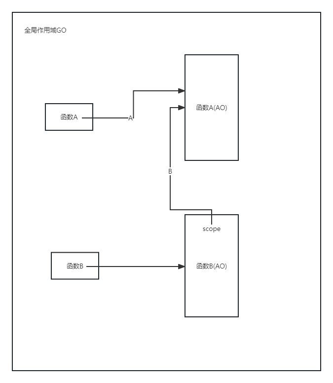

# 什么是闭包？
在js中，有一个全局作用域GO，浏览器环境可以狭义的理解为window对象，当我们新建一个函数A时，就产生了函数A的局部作用域AO,函数A执行完成后,函数作用域也会随之消失。但如果函数A返回了一个函数B,函数B 中使用到了函数A中的变量，则就算A函数执行完毕，由于返回到全局的函数B[[scope]]属性保持对函数A的引用，所以能够在外部访问到函数A内部变量，这就是我理解的闭包。

如下图：

当函数A执行完成之后,A对函数A作用域的引用消失，但是B一直保持对函数A的引用，所以函数A的作用域会存在于内存之中从而不会被垃圾回收。


# 闭包有什么用？
模拟私有变量
```js
    const obj = (function(){
        let a = 1
        return {
            add: () => a++,
            get: () => a
        }
    })()
    obj.get()   //1
    obj.add
    obj.get()   //2
```
可以看到，使用闭包后a为obj的私有变量